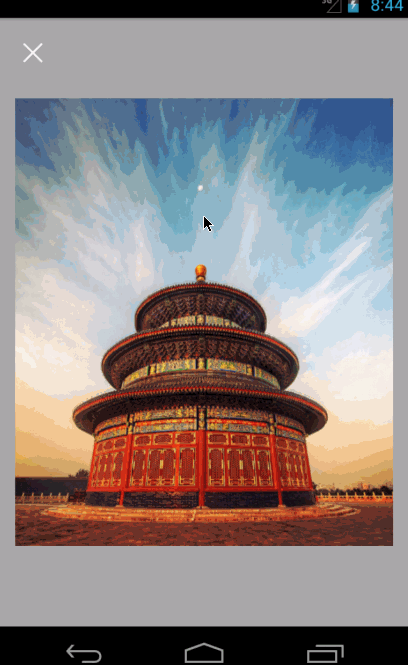
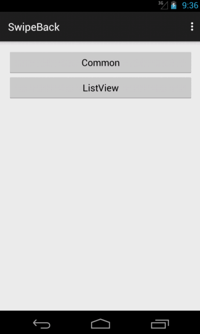

SwipeBack [](https://travis-ci.org/liuguangqiang/SwipeBack)
===========

SwipeBack is a android library that can finish a activity by using gesture.

You can set the swipe direction,such as left,top,right and bottom.

## Screenshots




## Sample Download
[Sample Download](https://github.com/liuguangqiang/SwipeBack/raw/master/Images/apks/swipe_back_demo_v1.0.apk)


## Usage

### Gradle
```
dependencies {
   	compile 'com.github.liuguangqiang.swipeback:library:1.0.2@aar'
}
```

### Maven
```
<dependency>
  	<groupId>com.github.liuguangqiang.swipeback</groupId>
  	<artifactId>library</artifactId>
  	<version>1.0.2</version>
  	<type>aar</type>
</dependency>
```
### SwipeBackActivity
SwipeBackActivity is a base activity for using this library more easier.This Activity will help us to show a shadow.


```
public class CommonActivity extends SwipeBackActivity {

    @Override
    protected void onCreate(Bundle savedInstanceState) {
        super.onCreate(savedInstanceState);
        setContentView(R.layout.activity_common);
        setDragEdge(SwipeBackLayout.DragEdge.LEFT);
    }

}
```

### Layout and activity theme.
SwipeBackLayout must contains only one direct child.

```
<com.liuguangqiang.swipeback.SwipeBackLayout
	xmlns:android="http://schemas.android.com/apk/res/android"
    android:id="@+id/swipeBackLayout"
    android:layout_width="match_parent"
    android:layout_height="match_parent">
	
	<!-- SwipeBackLayout must contains only one direct child -->

</com.liuguangqiang.swipeback.SwipeBackLayout>
```

```
 <style name="Theme.Swipe.Back" parent="Theme.AppCompat.Light.DarkActionBar">
        <item name="android:windowIsTranslucent">true</item>
        <item name="android:windowBackground">@android:color/transparent</item>
        <item name="windowActionBar">false</item>
        <item name="android:windowNoTitle">true</item>
 </style>
```

### Swipe Direction
You can set  DragEdge to change the swipe direction.

```
 public enum DragEdge {
      	LEFT,
      	
        TOP,
        
        RIGHT,
        
        BOTTOM
    }
```

### Support Views
SwipeBackLayout must contains only one direct child.

Such as:

* LinearLayout,
* RelativeLayout,
* ListView,
* ViewPager
* WebView

## License

    Copyright 2015 Eric Liu

    Licensed under the Apache License, Version 2.0 (the "License");
    you may not use this file except in compliance with the License.
    You may obtain a copy of the License at

       http://www.apache.org/licenses/LICENSE-2.0

    Unless required by applicable law or agreed to in writing, software
    distributed under the License is distributed on an "AS IS" BASIS,
    WITHOUT WARRANTIES OR CONDITIONS OF ANY KIND, either express or implied.
    See the License for the specific language governing permissions and
    limitations under the License.


